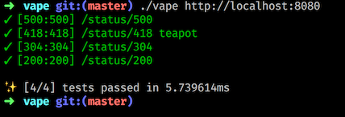
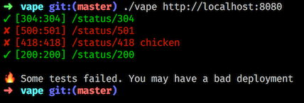

---

#Smoke Testing

---?image=assets/circuit-board.jpg

#   What

---

#Why

---

🚛💨 OR 🔥🚛🔥


---

```
[
  {
    "uri": "/status/418",
    "status_code": 418,
    "content": "teapot"
  },
  {
    "uri": "/status/200",
    "status_code": 200
  },
  {
    "uri": "/status/304",
    "status_code": 304
  },
  {
    "uri": "/status/500",
    "status_code": 500
  }
]
```




---

# Kthx

## github.com/symm/vape


